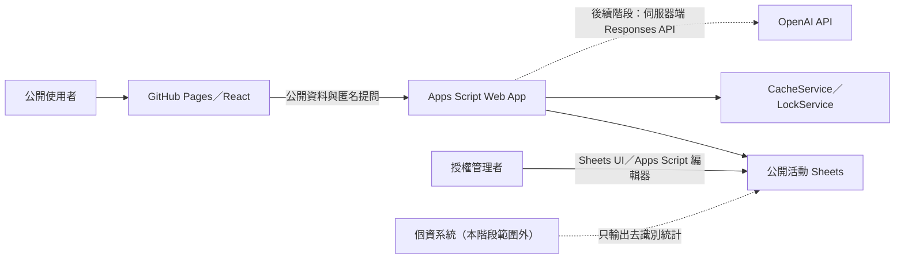

# 系統架構與安全邊界

## 設計原則

1. `Schema.js` 是欄位、型態、必填、唯一、公開性與範例資料的單一來源。
2. 公開讀取先判斷資料列 `status=published`、`is_public=true`，再依 schema 的 `public` 欄位白名單投影。
3. 匿名寫入只有 `Questions`；不接受任何姓名或聯絡資訊，且寫入時使用 `LockService`。
4. 公開讀取使用 `CacheService`。試算表變更後最長可能等待 `CACHE_SECONDS` 才反映；緊急更新可從 Apps Script 清除 Script Cache 或調低 TTL。
5. AuditLog 不記錄完整提問或請求內容，只記錄雜湊識別碼、動作、結果與資源 ID。
6. 管理初始化函式不在 `doGet`／`doPost` 路由中，匿名部署無法呼叫。

## 個資隔離

公開活動試算表禁止存放姓名以外的講者私人資料，以及觀眾姓名、電話、電子郵件、護照、航班、房號、飲食與病史。`Speakers` 只放經核准公開的職稱、機構、簡介、照片與網站。完整報名資料應使用另一份權限受限且不連接 AI 的資料來源；本系統只接收彙整數字。

## 未來 AI 邊界

後續 AI 服務應位於可安全保存祕密的伺服器端，使用 Responses API，模型名稱由 `OPENAI_MODEL` 等環境變數取得，不在程式碼寫死。送出前要以資料分類器阻擋個資；回傳內容寫入 `AIOutputs` 時預設 `is_draft=true`、`review_status=pending`，前端不得在人工核准前視為正式資訊。日期、地點、講者及價格只能引用已核准來源，不允許模型自行補寫。
